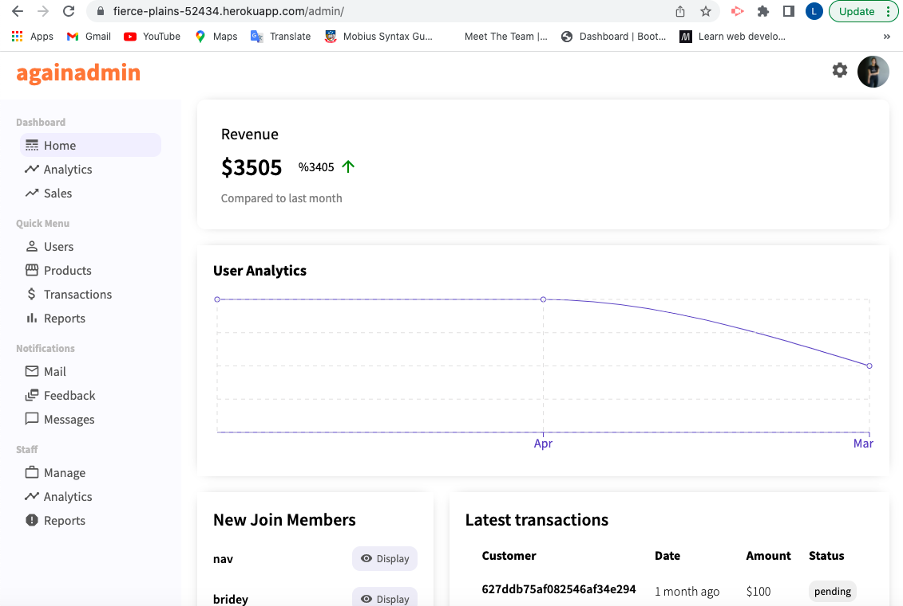
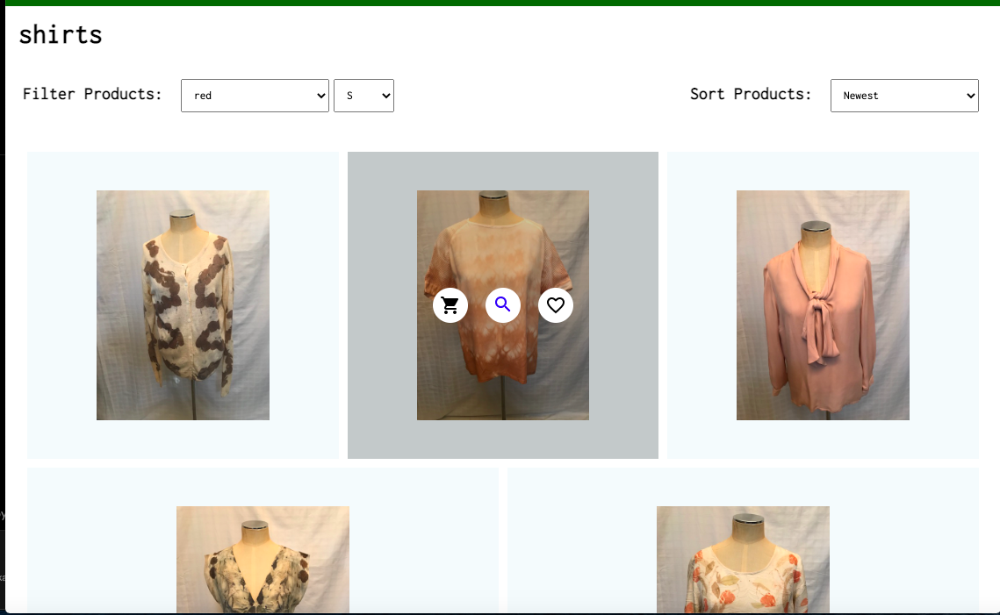
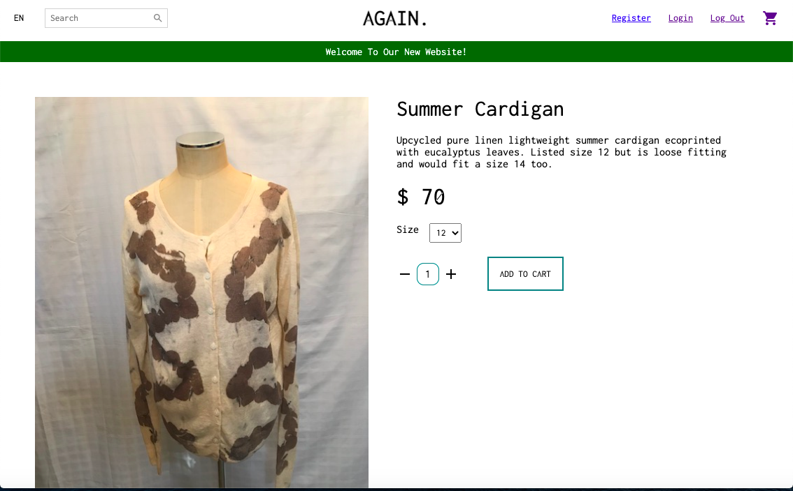
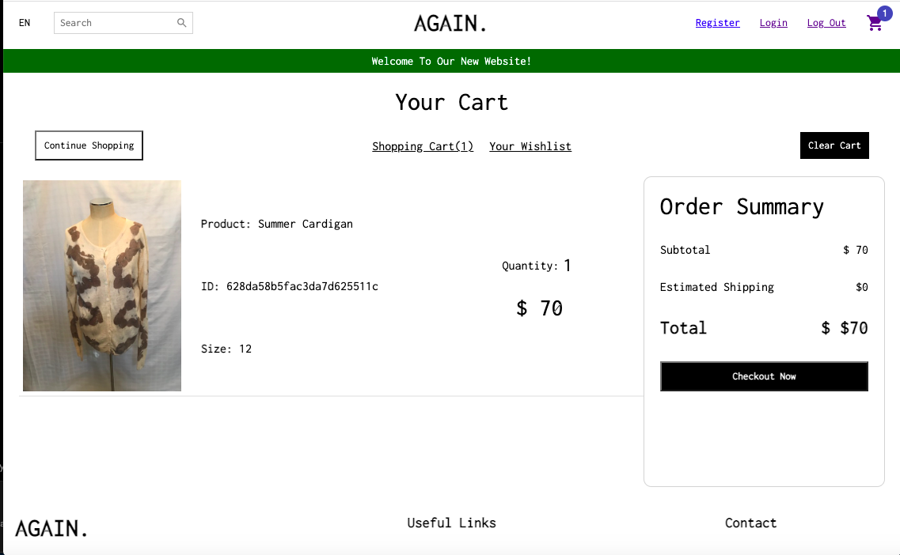
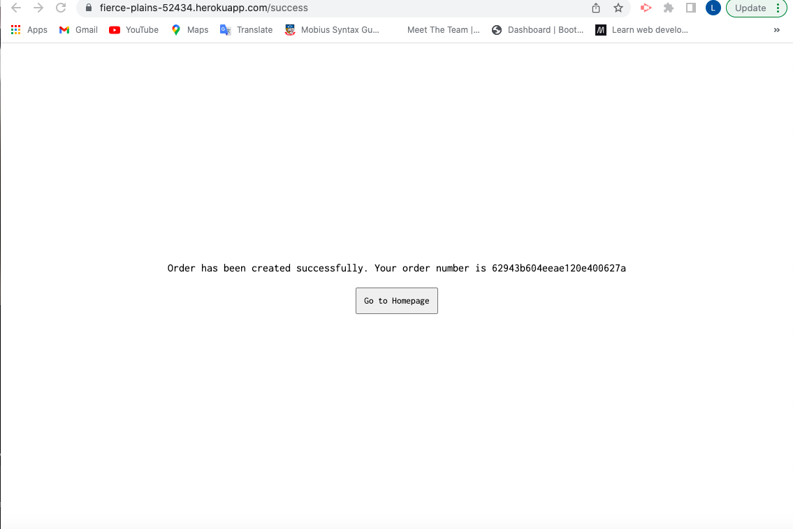
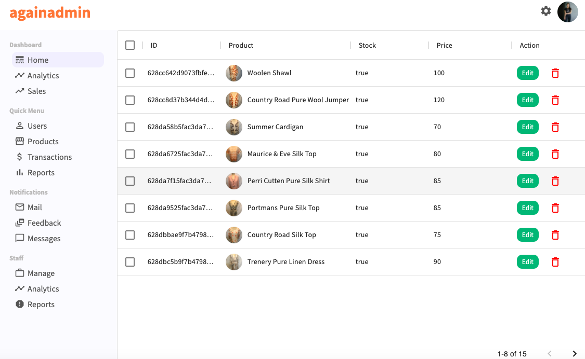
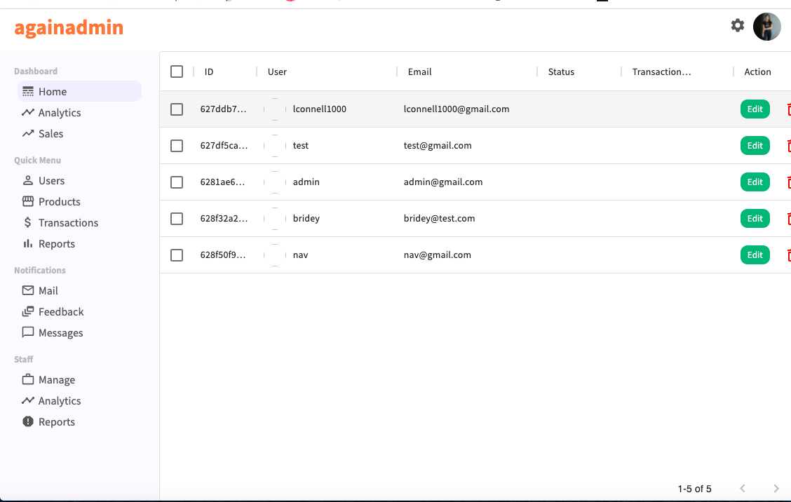
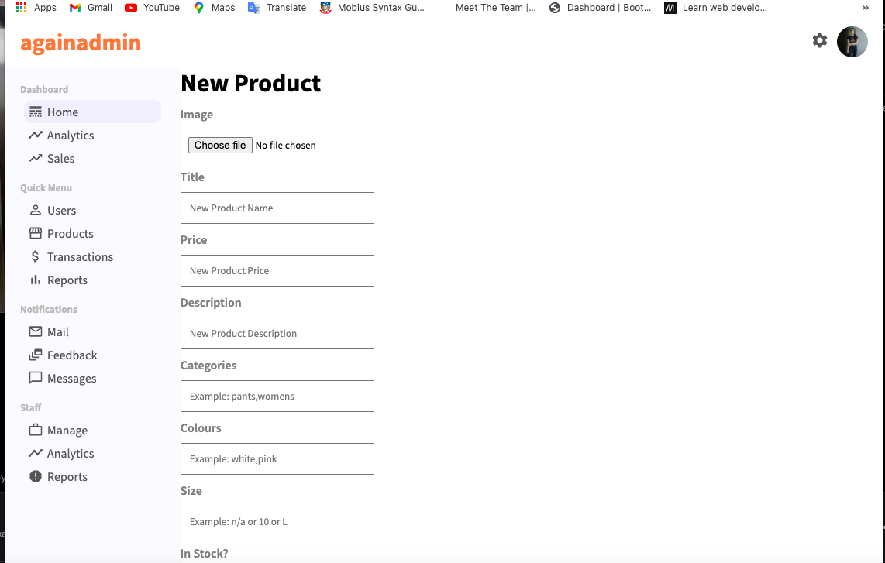

# Again Store - Full Stack MERN E-Commerce Application

## Elevator Pitch

Again Ecommerce store is a shopping store for my mothers clothing business. Because this is something that's useful to my mum it was great incentive to do a good job

## User Story
```
AS A small Business
I WANT an Ecommerce store to sell my product’s on
SO THAT I can generate income for my business
```

## Screenshot of the application once deployed
The image below shows the homepage


The image below shows a page with a selected category


The image below shows an individual product page


The image below shows the shopping cart page


The image below shows the success page after placing an order


The image below shows the admin home page


The image below shows the admin products page


The image below shows the admin users page


The image below shows the admin create a product page



## Link to presentation on my app

https://docs.google.com/presentation/d/13a7tRmP2WdlpSS-UV20AiTJngLi4pHvrk50mF3Je9Rg/edit?usp=sharing

## Link to deployed application

https://fierce-plains-52434.herokuapp.com/
